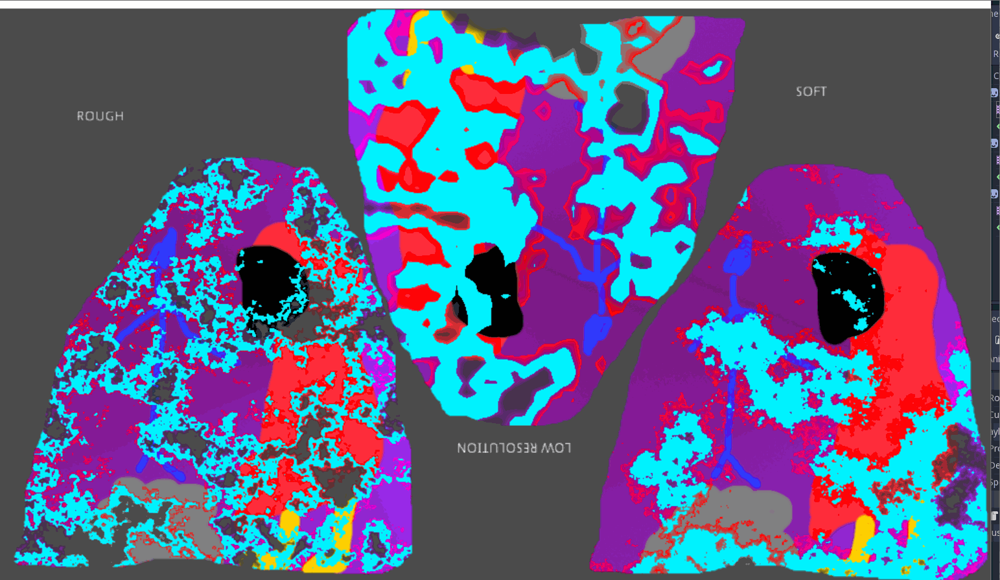

# Color Fade

This shader is a little trickier than the first ones I wrote. Inspired by Hearthstone's hero transformation cards (notably the DeathKnight Hero cards), this shader fades an image by 'burning' it away.

To do this, first we need a noise mask. Cloud-like noise is the most effective, as it has numerous starting points, singular fade points, and smoother transitions. We also need a few other parameters such as edge color, how long to fade to/away from the edge, and how long to hold the color.

First, the shader samples the noise mask. Then, depending on the amount of the fade shader to apply, it determines if it should be fading to a color, holding that color, or fading away from that color. Finally, after the amount is greater than the threshold + the color fade time, it is invisible.

There is a linear animation applied to the amount so you can see it in action, and I tried it with three different noise masks, each with their own effects. These look much better in real-time, the .gif does *not* do them justice!

I think this effect could also be used for a 'burning paper' look if you changed the color to orange/red.

# Example

