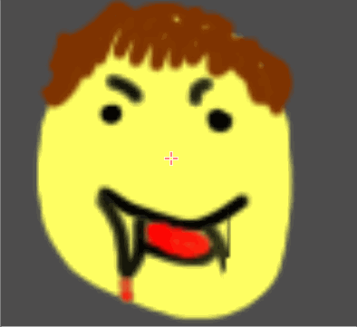
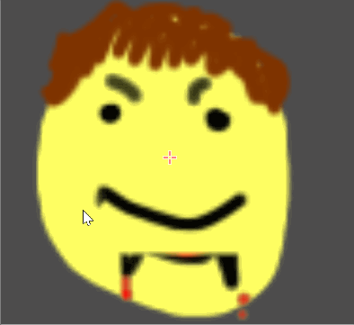

# Reveal

This is a very basic shader that reveals another image over a base image via a mask.
First, the shader samples the base image. Then, it samples the mask to find out how much of the base image to use.
It then uses the sampled intensity to determine how much of the base image should be used vs. the mask overlay.

I added a simple sinusoidal movement to the mask to give it some motion.

# Example

