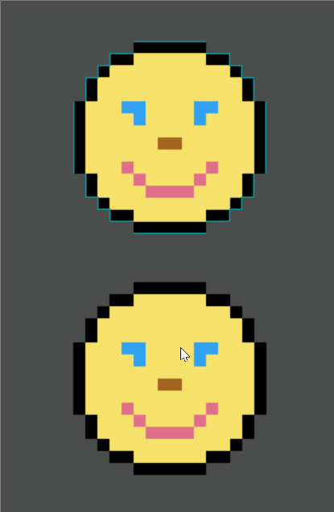

# Sprite Inline

This shader is nearly identical to the [Sprite Outline](../sprite_outline/) shader, only it's inverted! This provides an 'outline' that consumes the outer parts of the sprite instead of growing the sprite. Not entirely sure of it's uses but I'm sure there's something.

To do this, we first sample bits _further_ from the UV position based on the intensity, which simulates the image being shrunk down. It's a little counterintuitive, I know...
Then, if we sampled a pixel that has the full size but not the shrunk color, it's rendered the inline color.

The example below has animations for two sprites, one with the shader and one without so you can compare.
It also animates the intensity to give a better idea of what it will look like.

# Example

