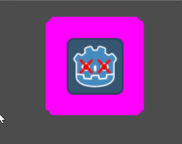

# Sprite Outline (No Shader)

## Don't use this. Use the [Shader Sprite Outline](../sprite_outline/) instead, it's way better!

This one isn't really a shader, and I'm not very proud of this implementation. Due to a number of engine limitations, it is not possible (as far as I can tell) to easily do an outline. Typically, outlines will be a first, larger render of the sprite in the solid color, and then the original sprite will be rendered on top, covering all but the outlined edge. Since we cannot apparently do multiple render passes in 2D with Godot, we have to use a more traditional solution.

This solution, however, is probably way more complicated than it needs to be. First, we make a copy of the sprite node and add it as a child of the sprite. Then we modify it's scale slightly and apply a shader that just renders a solid color (if it's alpha fits within a threshold). However, there are going to possibly be a lot of issues if you try to apply this on anything more complicated than just a sprite. I don't recommend this method.

This method only really works best on centered sprites without a lot of small, thin details.

I've added a simple animation to change the size of the outline.

# Example
