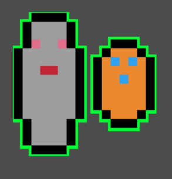
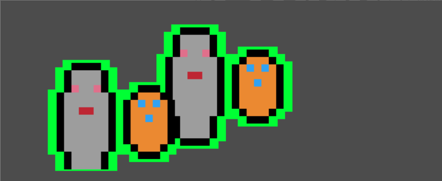

# Sprite Pixel Outline

This is a second attempt at implementing sprite outlining. The [first attempt](../sprite_outline) uses simple scaling and recoloring to create the effect. However, this would have issues with non-centered sprites, sprites with holes or otherwise complex shapes. Instead, this version of the shader samples multiple pixes on each draw, and determines if it should be an outline.

To do this, we first scale up the image like before to ensure there is room for the outline. Then, the image is scaled back down, and each pixel is sampled. After getting the color at the regular sprite we then sample each pixel based on the intensity of the outline. If we notice that we don't have alpha but the sample does, that means we are on the edge of a shape and need to create the outline.

The first example showcases a regular sprite with complex shapes. In the previous implementation only the outer edges would have an outline, and it would be inconsistent.

The second example actually takes advantage of a ViewPort node to do the outline on a subscene. Instead of outlining each sprite and rendering them over eachother (which would probably still work, but layering would be an issue) instead the images are composited together into a single image. Then, that final image uses the shader to sample outlines and apply them as a final step. This way you can have complex characters built of multiple sprites but give them a single outline.

> For those unfamiliar with ViewPorts, they allow you to take a snapshot of a scene to use elsewhere. In this case, we take the viewport, and render it as a sprite elsewhere in the scene. then, we apply the shader to that sprite to get the effect.
>
>The Node Tree looks like:

```
root
-ViewPort
--Camera2D
--Sprite1
--Sprite2
-Sprite
```

# Example



