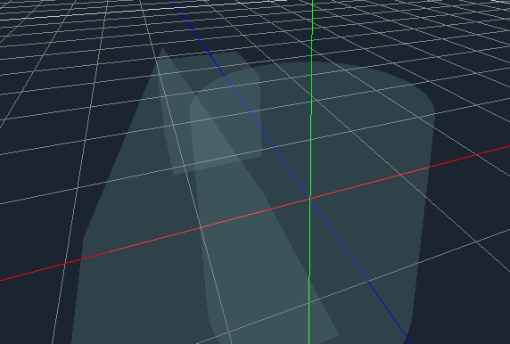

# Overdraw

This basic 3d shader is a recreation of a common viewport setting in most editors. Instead of rendering a mesh normally or with any lighting, it instead renders a flat, translucent color. Any meshes that stack on top of eachother will add to this color, creating outlines that show the shapes at a quick glance.

The shader is really simple - it simply changes the fragment color to match the input color when rendering the image. By setting the render mode, we can achieve the effect.

# Example

